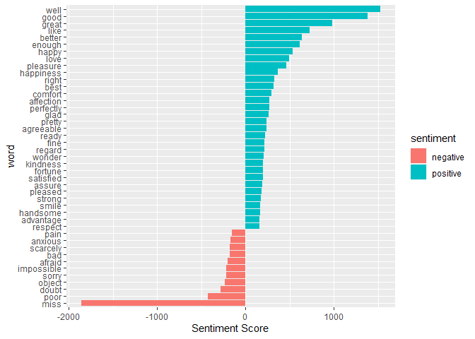
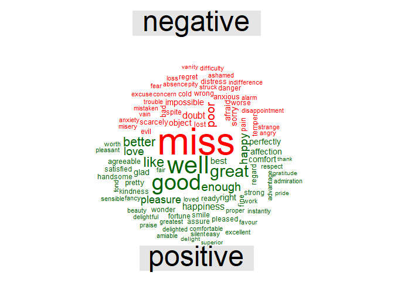

Sentiment Analysis
================
Anisha Ray
2022-09-11

``` r
library(tidytext) #contains sentiment lexicons
```

    ## Warning: package 'tidytext' was built under R version 4.1.3

``` r
get_sentiments("bing") #to extract sentiments out of data
```

    ## # A tibble: 6,786 x 2
    ##    word        sentiment
    ##    <chr>       <chr>    
    ##  1 2-faces     negative 
    ##  2 abnormal    negative 
    ##  3 abolish     negative 
    ##  4 abominable  negative 
    ##  5 abominably  negative 
    ##  6 abominate   negative 
    ##  7 abomination negative 
    ##  8 abort       negative 
    ##  9 aborted     negative 
    ## 10 aborts      negative 
    ## # ... with 6,776 more rows

``` r
library(janeaustenr) # books written by Jane Austen
```

    ## Warning: package 'janeaustenr' was built under R version 4.1.3

``` r
library(stringr) 
```

    ## Warning: package 'stringr' was built under R version 4.1.3

``` r
library(tidytext) # allows to perform text analysis
library(tidyr)
```

    ## Warning: package 'tidyr' was built under R version 4.1.3

``` r
library(dplyr)
```

    ## Warning: package 'dplyr' was built under R version 4.1.3

    ## 
    ## Attaching package: 'dplyr'

    ## The following objects are masked from 'package:stats':
    ## 
    ##     filter, lag

    ## The following objects are masked from 'package:base':
    ## 
    ##     intersect, setdiff, setequal, union

``` r
tidy_data <- austen_books() %>%
  group_by(book) %>%
  mutate(linenumber = row_number(),
         chapter = cumsum(str_detect(text, regex("^chapter [\\divxlc]", 
                                                 ignore_case = TRUE)))) %>%
  ungroup() %>%
  unnest_tokens(word, text) # tidy formating
```

``` r
positive_senti <- get_sentiments("bing") %>%
  filter(sentiment == "positive") # filter works implying joy
```

``` r
tidy_data %>%
  filter(book == "Emma") %>%
  semi_join(positive_senti) %>%
  count(word, sort = TRUE)
```

    ## Joining, by = "word"

    ## # A tibble: 668 x 2
    ##    word         n
    ##    <chr>    <int>
    ##  1 well       401
    ##  2 good       359
    ##  3 great      264
    ##  4 like       200
    ##  5 better     173
    ##  6 enough     129
    ##  7 happy      125
    ##  8 love       117
    ##  9 pleasure   115
    ## 10 right       92
    ## # ... with 658 more rows

``` r
bing <- get_sentiments("bing")
Emma_sentiment <- tidy_data %>%
  inner_join(bing) %>%
  count(book = "Emma" , index = linenumber %/% 80, sentiment) %>%
  spread(sentiment, n, fill = 0) %>%  # Separate columns for positive and negative
  mutate(sentiment = positive - negative)  # difference
```

    ## Joining, by = "word"

``` r
library(ggplot2)
```

    ## Warning: package 'ggplot2' was built under R version 4.1.3

``` r
ggplot(Emma_sentiment, aes(index, sentiment, fill = book)) +
  geom_bar(stat = "identity", show.legend = TRUE) +
  facet_wrap(~book, ncol = 2, scales = "free_x")
```

<!-- -->

``` r
counting_words <- tidy_data %>%
  inner_join(bing) %>%
  count(word, sentiment, sort = TRUE)
```

    ## Joining, by = "word"

``` r
head(counting_words)
```

    ## # A tibble: 6 x 3
    ##   word   sentiment     n
    ##   <chr>  <chr>     <int>
    ## 1 miss   negative   1855
    ## 2 well   positive   1523
    ## 3 good   positive   1380
    ## 4 great  positive    981
    ## 5 like   positive    725
    ## 6 better positive    639

``` r
counting_words %>%
  filter(n > 150) %>%
  mutate(n = ifelse(sentiment == "negative", -n, n)) %>%
  mutate(word = reorder(word, n)) %>%
  ggplot(aes(word, n, fill = sentiment))+
  geom_col() +
  coord_flip() +
  labs(y = "Sentiment Score")
```

<!-- -->

``` r
library(reshape2)
```

    ## Warning: package 'reshape2' was built under R version 4.1.3

    ## 
    ## Attaching package: 'reshape2'

    ## The following object is masked from 'package:tidyr':
    ## 
    ##     smiths

``` r
library(wordcloud)
```

    ## Warning: package 'wordcloud' was built under R version 4.1.3

    ## Loading required package: RColorBrewer

    ## Warning: package 'RColorBrewer' was built under R version 4.1.3

``` r
tidy_data %>%
  inner_join(bing) %>%
  count(word, sentiment, sort = TRUE) %>%
  acast(word ~ sentiment, value.var = "n", fill = 0) %>%
  comparison.cloud(colors = c("red", "dark green"),
                   max.words = 100)
```

    ## Joining, by = "word"

<!-- -->
